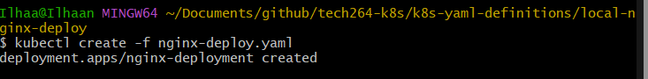
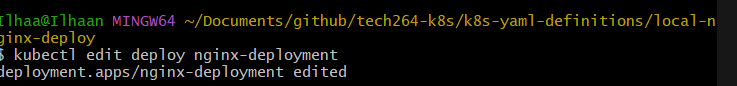
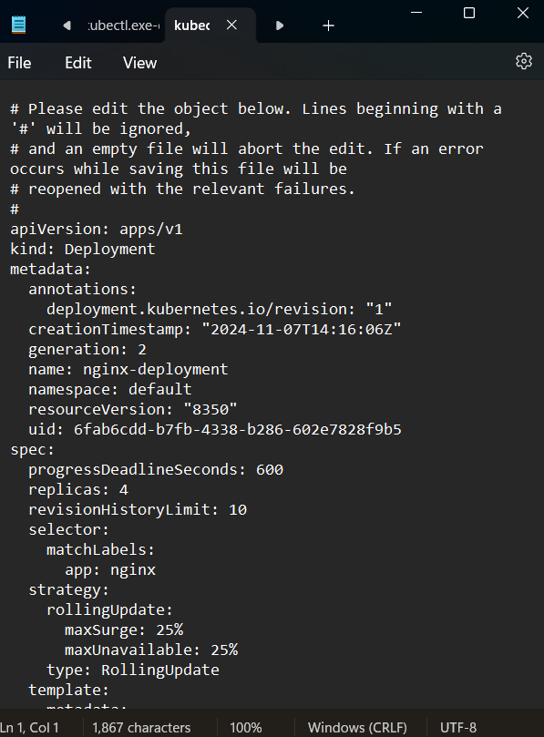
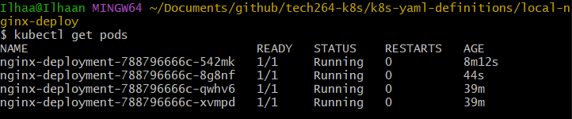
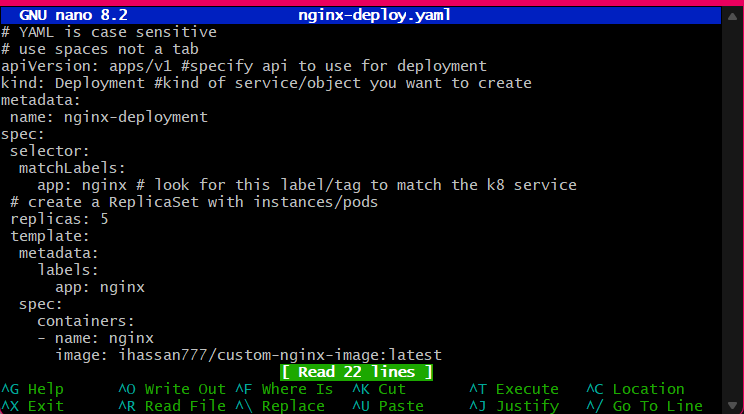
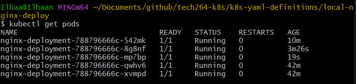
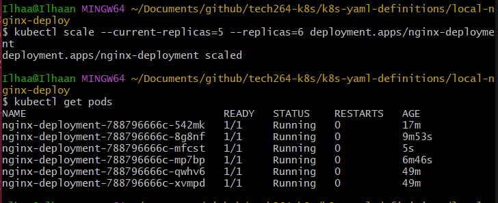
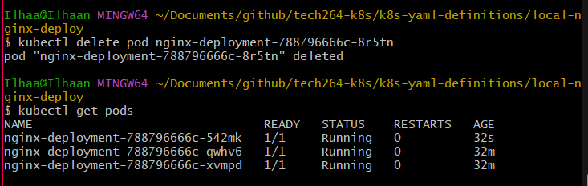

# ***DEPLOYING THE SPARTA TEST APP USING K8S***

- [***DEPLOYING THE SPARTA TEST APP USING K8S***](#deploying-the-sparta-test-app-using-k8s)
  - [***Deploying NGINX***](#deploying-nginx)
    - [***Steps to take:***](#steps-to-take)
      - [Different editing methods for yaml file to change deployment](#different-editing-methods-for-yaml-file-to-change-deployment)

## ***Deploying NGINX***
### ***Steps to take:***
1. Once, you have downloaded Kubernetes using [these instructions](./download-kubernetes.md), we can now check if NGINX will run
2. create a repo named **`k8s-yaml-definitions`** to house all of our yaml files
3. Within that repo, create a repo named **`local-nginx-deploy`** and within that create two yaml files named **[`nginx-deploy.yaml`](/tech264-k8s/k8s-yaml-definitions/local-nginx-deploy/nginx-deploy.yaml)** and **[`nginx-service.yaml`](/tech264-k8s/k8s-yaml-definitions/local-nginx-deploy/nginx-service.yaml)**. You will find a detailed explanation for each command in those files.
4. Run the `kubectl create -f <file-name>` command for both files

#### Different editing methods for yaml file to change deployment
1. You can edit your yaml file configuration on the fly with a few different methods
2. Firstly, you can use this command

3. This will bring up a notepad with the yaml file

4. You can edit the file and apply the changes to see them change in real-time, I changed the number of replicas to 4 and this was the result when I checked the pods using **`kubectl get pods`**, as you can see there are now 4 pods

5. You cann also edit the file using **`nano <file-name>`**
6. Here you can see I have changed the number of pods from 4 to 5:

7. You can use the command below to scale, here was have scaled up from 5 to 6:

8. Pods are ephemeral, meaning they are easily deleted, re-created or modified. However, if you specify a number of replicas, that will be the minimum number of pods that exist at all times. If i delete a pod, it will be replaced by another one.

