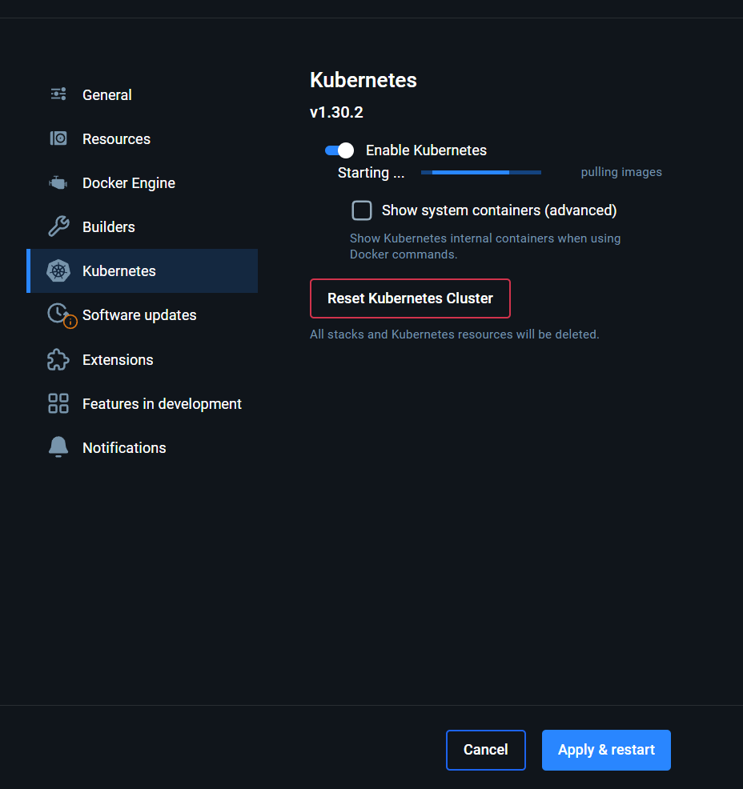
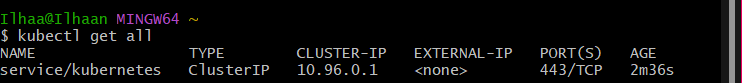

## ***How to download Kubernetes***
1. Open **Docker Desktop**, make sure you run as **administator**
2. Find the Kubernetes panel, inside the **settings**

1. **Enable Kubernetes**, select **Apply & Restart**. This may take a few minutes. Once the window has restarted, you should be able to see *kubernetes running* in the bottom corner of the desktop window.

1. Open a **GitBash** window, run the command **`kubectl get all`** and now your kubernetes service should be running.
